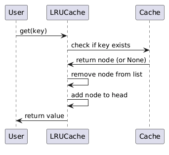
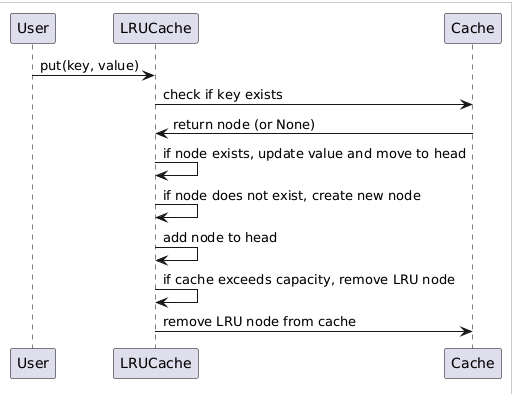

## Object-oriented design for LRU Cache

## 1. Define Requirements

### Functional Requirements
- **Initialize Cache**: The cache should be initialized with a positive integer capacity that determines the maximum number of items it can store.
- **Get Value**: Retrieve the value associated with a given key. If the key does not exist, return -1.
- **Put Value**: Insert or update the key-value pair in the cache. If the cache exceeds its capacity, remove the least recently used (LRU) item.
- **Eviction**: Ensure that when the cache is full and a new item needs to be added, the least recently used item is removed to make space.

### Non-Functional Requirements
- **Time Complexity**: Both `get` and `put` operations must run in O(1) average time complexity.
- **Space Complexity**: The cache should use space proportional to its capacity.
- **Concurrency**: The cache should handle concurrent operations if extended for multi-threaded use cases (though basic design here won't include concurrency handling).

## 2. Identify Key Entities
- **Cache**: Manages key-value pairs and maintains the order of use.
- **Node**: Represents a node in the doubly linked list, storing key-value pairs and pointers to adjacent nodes.
- **Doubly Linked List**: Maintains the order of items, with the most recently used at the head and the least recently used at the tail.

## 3. Design Class Structure

### 3.1 Class Diagram

**Class: Node**

- **Attributes:**
  - `key: int`
  - `value: int`
  - `prev: Node`
  - `next: Node`
- **Methods:**
  - Constructor (`__init__`)

**Class: LRUCache**

- **Attributes:**
  - `capacity: int`
  - `cache: dict` (mapping of key to Node)
  - `head: Node` (dummy head)
  - `tail: Node` (dummy tail)
- **Methods:**
  - `__init__(self, capacity: int)`: Initializes the cache with a given capacity.
  - `get(self, key: int) -> int`: Retrieves the value for the given key.
  - `put(self, key: int, value: int)`: Inserts or updates the key-value pair.
  - `_remove(self, node: Node)`: Removes a node from the doubly linked list.
  - `_add(self, node: Node)`: Adds a node to the head of the doubly linked list.
  - `__repr__(self) -> str`: Custom representation of the cache.

### 3.2 Relationships
- **LRUCache** uses **Node** objects and maintains a doubly linked list for ordering.
- **Node** objects are linked via `prev` and `next` pointers.
- **LRUCache** contains a dictionary (`cache`) for O(1) access to nodes by key.

## 4. Design Use Case Diagrams

### Use Case 1: Get Value

- **Actor**: User
- **Precondition**: Cache is initialized.
- **Main Flow**:
  - User requests the value associated with a key.
  - Cache checks if the key exists.
  - If the key exists, the cache moves the corresponding node to the head.
  - Returns the value of the node.
- **Postcondition**: Node is marked as most recently used.

### Use Case 2: Put Value

- **Actor**: User
- **Precondition**: Cache is initialized.
- **Main Flow**:
  - User inserts or updates a key-value pair.
  - Cache checks if the key already exists.
  - If the key exists, update the value and move the node to the head.
  - If the key does not exist, create a new node and add it to the head.
  - If the cache exceeds its capacity, remove the least recently used node (from the tail).
- **Post-condition**: Node is added or updated, and the cache size is managed.

## 5. Design Sequence Diagrams

### Sequence Diagram for `get` Operation:

  

### Sequence Diagram for `put` Operation:

  

