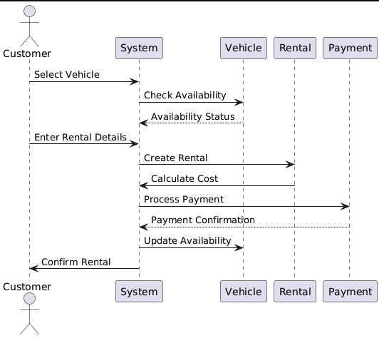
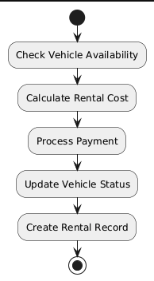

## Object-oriented design for a car rental system. 

### 1) Define Requirements
####   Functional Requirements:
* **Vehicle Management**: Add, update, and remove vehicles from the inventory.
* **Rental Management**: Handle car rentals, including booking, returning, and tracking rental status.
* **Customer Management**: Manage customer details and their rental history.
* **Pricing**: Calculate rental costs based on vehicle type, rental duration, and any additional services.
* **Payment Processing**: Process payments for rentals and handle invoices.
####   Non-Functional Requirements:
* **Scalability**: Support a growing number of vehicles and customers.
* **Maintainability**: Easy to update and manage the system.
* **Security**: Ensure customer data and payment information are protected.
* **Performance**: Fast response times for rental transactions and queries.
### 2) Identify Key Entities
   From the requirements, we can identify the following key entities:
* **Vehicle**
* **Rental**
* **Customer**
* **Pricing**
* **Payment**
### 3) Design Class Structure
**Class Diagram**
* Vehicle
```
Attributes: vehicle_id, make, model, year, rental_rate, availability_status
Methods: update_availability(), get_vehicle_details()
```
* Rental
```
Attributes: rental_id, customer, vehicle, rental_start_date, rental_end_date, status
Methods: calculate_cost(), return_vehicle(), get_rental_details()
```
* Customer
```
Attributes: customer_id, name, email, phone, address
Methods: rent_vehicle(), return_vehicle(), view_rentals()
```
* Pricing
```
Attributes: vehicle_type, daily_rate, weekly_rate
Methods: calculate_rental_cost()
```
* Payment
```
Attributes: payment_id, rental, amount, payment_date, payment_status
Methods: process_payment(), refund_payment(), get_payment_details()
```
**Relationships**
* Customer can have multiple Rental records.
* Rental is associated with one Vehicle.
* Vehicle has one Pricing structure.
* Rental can have one Payment.
### 4) Design Use Case Diagrams
**1) Use Case: Rent a Vehicle**
* Actors: Customer
* Use Cases:
  * Select Vehicle
  * Enter Rental Details
  * Confirm Rental
  * Make Payment
**2) Use Case: Manage Vehicle Inventory**
* Actors: Admin
* Use Cases:
    * Add Vehicle
  * Update Vehicle Information
  * Remove Vehicle
### 5) Design Sequence Diagrams
**Example: Rent a Vehicle**
1. Customer selects a vehicle.
2. System checks vehicle availability.
3. Customer enters rental details and confirms the rental.
4. System calculates the rental cost.
5. Customer makes the payment.
6. System updates vehicle availability and creates a rental record.

<p align="center">
  
</p>

### 6) Design Activity Diagrams
**Example: Process Rental**
1. Start
2. Check Vehicle Availability
3. Calculate Rental Cost
4. Process Payment
5. Update Vehicle Status
6. Create Rental Record
7. End


<p align="center">
  
</p>