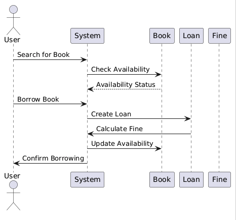
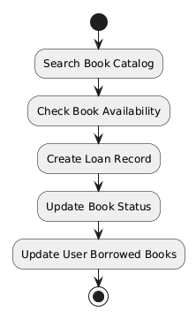

## Object-oriented design for a library management system. 

### 1) Define Requirements
####   Functional Requirements:
* **Book Management**: Add, update, remove books, and track their availability.
* **User Management**: Handle user registrations, user information, and manage user accounts.
* **Loan Management**: Manage book checkouts, returns, and track overdue books.
* **Catalog Search**: Allow users to search for books by title, author, or genre.
* **Reservation Management**: Allow users to reserve books that are currently checked out.
* **Fine Management**: Calculate and manage fines for overdue books.
####   Non-Functional Requirements:
* **Scalability**: Support a growing number of books and users.
* **Maintainability**: Easy to update and manage the system.
* **Performance**: The system should quickly respond to searches and transactions.
* **Security**: Ensure user data is protected and access to the system is secure..
### 2) Identify Key Entities
   From the requirements, we can identify the following key entities:
* **Book**
* **User**
* **Loan**
* **Reservation**
* **Fine**
### 3) Design Class Structure
**Class Diagram**
* Book
```
Attributes: book_id, title, author, genre, availability_status
Methods: update_availability(status: boolean), get_book_details()
```
* User
```
Attributes: user_id, name, email, phone, address, borrowed_books, reserved_books
Methods: borrow_book(book: Book), return_book(book: Book), reserve_book(book: Book), view_borrowed_books(), view_reserved_books()
```
* Loan
```
Attributes: loan_id, user, book, loan_date, due_date, return_date, status
Methods: calculate_fine(), return_book(), get_loan_details()
```
* Reservation
```
Attributes: reservation_id, user, book, reservation_date, status
Methods: cancel_reservation(), get_reservation_details()
```
* Fine
```
Attributes: fine_id, loan, amount, fine_date, status
Methods: calculate_fine(), pay_fine(), get_fine_details()
```
**Relationships**
* User can have multiple Loans and Reservations.
* Book can have multiple Loans and Reservations.
* Loan and Reservation are associated with one Book and one User.
* Fine is associated with one Loan.
### 4) Design Use Case Diagrams
**1) Use Case: Borrow a Book**
* Actors: User
* Use Cases:
  * Search for Book
  * Borrow Book
  * View Borrowed Books
**2) Use Case: Manage Book Inventory**
* Actors: Librarian
* Use Cases:
  * Add Book
  * Update Book Information
  * Remove Book
### 5) Design Sequence Diagrams
**Example: Borrow a Book**
1. User searches for a book.
2. System checks the book’s availability.
3. User selects a book and initiates borrowing.
4. System creates a Loan record and updates the book’s availability.
5. System updates the user’s borrowed books list.
<p align="center">
  
</p>

### 6) Design Activity Diagrams
**Example: Process Rental**
1. Start
2. Search Book Catalog
3. Check Book Availability
4. Create Loan Record
5. Update Book Status
6. Update User Borrowed Books
7. End


<p align="center">
  
</p>